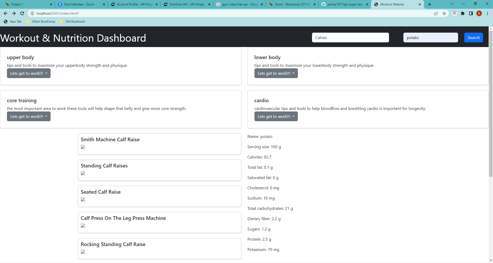

# go-super-team-1

Amala Hema Francis, Jamie Charlemagne , Edward Kiosa

## Project Name : Workout & Nutrtion Dashboard

# go-super-team-1-
## Project Name : Workout & Nutrtion Dashboard
## Table of contents
- Overview
    - User Story
    - Screenshot
    - Links
- My Approach
    - Code construction
    - Learnings
- Author
## Overview
### User Story
Create a workout dashboard with form inputs

  - The objective is to create a web page using HTML and CSS/Bootstrap to design and structure the layout. Additionally, two APIs will be utilized to retrieve dynamic data which can be manipulated using jQuery and JavaScript to further customize the page. 

  - When selecting a muscle in the workout options select menu, 
  - Then related exercise names from the exercise API will be displayed in a separate div.
   
  - When an input is given in the "Find my calories" search bar, such as a food name, 
  - Then nutritional API will display details of the nutritional information about the food.

  - When user select the specific excercise option from the selectbuttion, 
  - Then YouTube workout exercise video will be displayed through HTML and Bootstrap.

  ## scrrenshot
 
  ![The following image shows the web application's appearance and functionality:
  The workout app incluse search exercise name and find the nutrition of the food.]
  
  
  ### Links
   Github url https://github.com/jamiec1077/go-super-team-1-
   
   ## My Approach

### Code Construction

- Html,CSS & Bootstrap
- API fetch ,Jquery & Javascript

### Learnings

- How to create a page using HTML ,CSS and Bootstrap
- How to generate API key using Open API websites and use that in the fetch function
- How to use query parameters to display in webpage 
- How to create element dynamically and append to the parent
- How to clear the data for each fetch

  - The objective is to create a web page using HTML and CSS/Bootstrap to design and structure the layout. Additionally, two APIs will be utilized to retrieve dynamic data which can be manipulated using jQuery and JavaScript to further customize the page.
  - When selecting a muscle in the workout options select menu,
  - Then related exercise names from the exercise API will be displayed in a separate div.
  - When an input is given in the "Find my calories" search bar, such as a food name,
  - Then nutritional API will display details of the nutritional information about the food.
  - When user select the specific excercise option from the selectbuttion,
  - Then YouTube workout exercise video will be displayed through HTML and Bootstrap.
  ## scrrenshot
  ![The following image shows the web application's appearance and functionality:
  The workout app incluse search exercise name and find the nutrition of the food.]
  
  ### Links
   Github url https://github.com/jamiec1077/go-super-team-1-
   ## My Approach
### Code Construction
- Html,CSS & Bootstrap
- API fetch ,Jquery & Javascript
### Learnings
- How to create a page using HTML ,CSS and Bootstrap
- How to generate API key using Open API websites and use that in the fetch function
- How to use query parameters to display in webpage
- How to create element dynamically and append to the parent
- How to clear the data for each fetch
GitHubGitHub
GitHub - jamiec1077/go-super-team-1-: first project to test our skills
first project to test our skills . Contribute to jamiec1077/go-super-team-1- development by creating an account on GitHub. (42 kB)

